# awesome-free-stack

> The largest curated collection of **free developer resources**, **free AI APIs**, **student developer tools**, and **free cloud services**. Replace expensive SaaS with high-quality free alternatives.

<p align="center">
  <a href="https://github.com/girishlade111/awesome-free-stack"></a>
  <a href="https://github.com/girishlade111/awesome-free-stack/graphs/contributors"></a>
  <a href="LICENSE"></a>
  <a href="https://github.com/girishlade111/awesome-free-stack/commits/main"></a>
  <a href="https://github.com/girishlade111/awesome-free-stack/discussions"></a>
  <a href="https://github.com/girishlade111/awesome-free-stack/watchers"></a>
</p>

<p align="center">
  <a href="#-mission">Mission</a> •
  <a href="#-who-is-this-for">Who It's For</a> •
  <a href="#-features">Features</a> •
  <a href="#-system-architecture">Architecture</a> •
  <a href="#-categories">Categories</a> •
  <a href="#-anatomy-of-a-resource-page">Resource Anatomy</a> •
  <a href="#%EF%B8%8F-dev-stack--configuration">Dev Stack</a> •
  <a href="#-stats">Stats</a> •
  <a href="#-getting-started">Get Started</a> •
  <a href="#-recommended-workflows">Workflows</a> •
  <a href="#-build-recipes">Recipes</a> •
  <a href="#-learning-paths">Paths</a> •
  <a href="#-student-packs">Students</a> •
  <a href="#-startup-credits">Startups</a> •
  <a href="#-rankings">Rankings</a> •
  <a href="#-alternatives">Alternatives</a> •
  <a href="#-quick-wins">Quick Wins</a> •
  <a href="#-faq">FAQ</a> •
  <a href="#-contributing">Contribute</a>
</p>

---

## 🎯 Mission

**Replace expensive developer tools with free alternatives.**

This repository is the largest curated collection of **free and freemium resources** for developers, students, indie hackers, and startups. Every resource is:

- ✅ **Vetted** — Free tier confirmed working
- 🗂️ **Categorized** — Sorted into 20 categories with 135 subcategories
- ⭐ **Rated** — Scored across 7 metrics (1-5)
- 🏆 **Ranked** — Community-powered quarterly rankings
- 🔄 **Verified** — Monthly automated checks for broken links and expired free tiers

> 💡 **Save thousands of dollars per year.** Whether you need free cloud hosting, free AI APIs, student developer packs, free PostgreSQL databases, free authentication services, or free CI/CD pipelines — this repo has you covered.

### Why This Exists

Most developers pay for tools they don't need to. A typical indie project stack — AI assistant, database, hosting, auth, email, analytics, error tracking — costs **$100–$200/month** in subscriptions. Yet every one of those layers has a genuinely usable free tier or open-source equivalent that handles real production traffic.

The problem isn't availability — it's discoverability:

- Free tiers hide behind marketing pages with confusing limits
- Card requirements are disclosed only at signup
- Limits change without notice, breaking projects overnight
- Comparing 10 similar tools takes hours of tab-switching

This repository solves all four: every entry documents the **exact free tier**, whether a **credit card is required**, when it was **last verified**, and how it **compares to paid alternatives**.

---

## 👥 Who Is This For

| You Are | What You'll Find Here | Start Here |
|---|---|---|
| 🎓 **Student** | $200k+ in verified student offers: GitHub Pack, AWS/Azure/GCP credits, JetBrains IDEs, Figma Pro, Notion Plus | [Student Packs](#-student-packs) |
| 🧑‍💻 **Indie Hacker** | Complete $0 stacks to validate, build, launch, and monetize a side project — including analytics and payments | [Indie Hacker Path](./learning-paths/indie-hacker.md) |
| 🚀 **Startup Founder** | Up to $600k+ in cloud credits (AWS Activate, GCP, Azure) plus SaaS startup discounts from Stripe, Notion, Figma | [Startup Credits](#-startup-credits) |
| 💼 **Professional Developer** | Vetted replacements for expensive team tooling — monitoring, CI/CD, databases — with honest limit documentation | [Alternatives](#-alternatives) |
| 🔬 **AI Engineer** | Free LLM APIs (Gemini, Groq, DeepSeek), vector databases, embedding providers, agent frameworks, RAG tooling | [Best AI Tools 2026](./rankings/best-ai-tools-2026.md) |
| 📱 **Mobile Developer** | Free push notifications, app distribution via Expo EAS, mobile backends, crash reporting, deep linking | [Mobile Category](./categories/mobile) |
| 🧑‍🏫 **Educator / Learner** | Structured roadmaps built entirely on free resources — no paid courses required at any step | [Learning Paths](#-learning-paths) |

---

## 🧱 What You Can Build for $0

Every layer below is covered by at least one resource in this repo — combine them freely:

| Project Type | Free Stack | Monthly Cost |
|---|---|---|
| **SaaS MVP** | Next.js + Supabase + Vercel + Resend + PostHog | **$0** |
| **AI Chatbot / Agent** | Gemini API + pgvector + Vercel AI SDK + Clerk | **$0** |
| **Portfolio Site** | Astro + Cloudflare Pages + Umami | **$0** |
| **Mobile App** | Expo + Supabase + EAS + Sentry | **$0** |
| **Docs Site** | Next.js MDX + Meilisearch + GitHub Pages | **$0** |
| **File Sharing Service** | Cloudflare R2 + Supabase + Resend | **$0** |
| **Internal Tool Dashboard** | React + PocketBase + Render | **$0** |

---

## 💰 Real Cost Savings

Approximate list prices of common paid subscriptions vs. their free counterparts in this repo (prices change; always verify current pricing):

| Need | Typical Paid Tool | Price | Free Alternative From This Repo | Savings / Year |
|---|---|---|---|---|
| AI assistant | ChatGPT Plus | ~$20/mo | [Gemini API](./categories/ai), DeepSeek | ~$240 |
| Database + Auth + Storage | Supabase Pro | ~$25/mo | Supabase Free Tier | ~$300 |
| Web Hosting | Vercel Pro | ~$20/mo | [Cloudflare Pages](./categories/hosting) | ~$240 |
| Design Tool | Figma Professional | ~$15/mo | Penpot, Excalidraw | ~$180 |
| Docs & Notes | Notion Plus | ~$10/mo | AppFlowy, Outline | ~$120 |
| Transactional Email | SendGrid Essentials | ~$20/mo | [Resend](./categories/email-sms) (100/day) | ~$240 |
| Error Tracking | Sentry Team | ~$26/mo | GlitchTip, Highlight.io | ~$312 |
| Product Analytics | Mixpanel Growth | ~$28/mo | [PostHog](./categories/monitoring) (1M events/mo) | ~$336 |
| **Total** | | | | **≈ $2,000/year** |

> Students save even more: the [GitHub Student Developer Pack](./categories/student-packs/github-student-pack.md) alone unlocks $200k+ in partner offers.

---

## ✨ Features

### 📋 Core Features

- **20 Categories** — AI, hosting, databases, auth, payments, monitoring, CI/CD, design, mobile, and more
- **135 Subcategories** — Fine-grained classification (e.g., AI has: APIs, Models, Agents, RAG, Embeddings, Speech, Image Generation, ML Platforms, Vector DBs)
- **175 Standardized Tags** — Cross-cutting filters across 6 groups: Global, Category, Pricing, Region, Compatibility, Verification
- **7-Dimension Rating System** — Each resource scored 1-5 on beginner friendliness, docs quality, free generosity (weighted ×1.5), setup ease, reliability (×1.2), performance, and community
- **Composite Ranking Algorithm** — Weighted scores from community votes (25%), popularity (20%), maintainer score (30%), free quality (25%)
- **10 Verification Badges** — Tested, community-verified, deprecated, archived, student-friendly, india-friendly, top-rated, no-card, global, unverified
- **Paid-to-Free Mapping** — 80+ direct replacements for expensive tools like Notion → AppFlowy, Firebase → Supabase, ChatGPT → Gemini
- **7 Build Recipes** — Complete free stacks for SaaS, AI apps, MVPs, portfolios, mobile apps, docs sites, and file-sharing platforms
- **7 Learning Paths** — Curated roadmaps for Frontend, Backend, Full Stack, AI Engineering, DevOps, Mobile, and Indie Hacking
- **7 Student Pack Guides** — Step-by-step guides to claim $200k+ in free tools including GitHub Student Pack, AWS Educate, Azure for Students, Google Cloud for Students, Figma Education, Notion Education, JetBrains Student
- **5 Startup Credit Guides** — Apply to AWS Activate ($100k), Google Cloud for Startups ($200k), Azure for Startups ($150k), and more

### 🛠️ Automation & DevOps Features

- **6 GitHub Actions Workflows** — Automated validation, link checking, verification expiry detection, stats generation, README updates, and broken resource detection
- **JSON Schema Validation** — Full schema enforcement across all data files (resources, taxonomy, tags, ratings, badges, rankings, deprecated)
- **Monthly Verification Expiry** — Flags resources not re-tested in 6+ months; generates actionable issues
- **Bi-weekly Broken Resource Detection** — HTTP HEAD/GET checks on every resource URL; auto-creates issues for broken links
- **Monthly Link Checking** — `lychee` scans all markdown files for broken URLs
- **Monthly Stats Generation** — Auto-computed repository metrics committed to the repo
- **README Auto-Update** — Pull request with updated stats, categories, and top-rated resources

### 👥 Community Features

- **6 Discussion Categories** — Ideas, Tool Requests, Comparisons, Monthly Highlights, Support, Voting — each with dedicated templates
- **4 Issue Templates** — Add Resource, Report Broken Tool, Suggest Category, Feature Request — standardized for quick triage
- **PR Template** — Standardized submission checklist including free tier verification, category matching, tag validation, and cross-reference checking
- **Contributor Badges** — Tiered recognition for community members (Bronze/Silver/Gold based on contribution count)
- **Quarterly Voting System** — Community polls influence official rankings; votes weighted by contributor status
- **2-5 Business Day Review** — Maintainers review all submissions within 2-5 business days

---

## 🏗️ System Architecture

```mermaid
flowchart TB
    subgraph CONTRIBUTORS["Contributors"]
        PR[Pull Request]
        ISSUE[Issue / Discussion]
    end

    subgraph CONTENT["Content Layer"]
        CAT[category/*.md<br/>Resource Files]
        REC[recipes/<br/>Build Recipes]
        PATHS[learning-paths/<br/>Learning Paths]
        ALT[alternatives/<br/>Paid-to-Free Mappings]
        RANK_MD[rankings/<br/>Published Rankings]
        DEPR_MD[deprecated/<br/>Deprecation Logs]
    end

    subgraph DATA["Data Layer"]
        RES[data/resources.json<br/>Resource Entries]
        TAX[data/taxonomy.json<br/>20 Categories + 135 Subcategories]
        TAGS[data/tags.json<br/>175 Tags in 6 Groups]
        RATINGS[data/ratings.json<br/>7-Metric Scoring System]
        BADGES[data/badges.json<br/>10 Verification Badges]
        RANK_DATA[data/rankings.json<br/>4-Factor Ranking Engine]
        DEPR_DATA[data/deprecated.json<br/>12 Deprecated Entries]
        SCHEMA[data/*-schema.json<br/>JSON Validation Schemas]
    end

    subgraph CI["Automation Layer"]
        VALIDATE[validate-json.yml<br/>Schema + Consistency Checks]
        LINKS[check-links.yml<br/>Broken Link Detection]
        VERIFY[monthly-verification.yml<br/>Verification Age Tracking]
        STATS[generate-stats.yml<br/>Monthly Statistics]
        README_UPDATE[update-readme.yml<br/>README Auto-Update]
        BROKEN[detect-broken-resources.yml<br/>URL Health Checks]
    end

    subgraph OUTPUT["Output Layer"]
        README[README.md<br/>Main Entry Point]
        DISCUSS[DISCUSSIONS.md<br/>Community Guide]
        CONTRIB[CONTRIBUTING.md<br/>Contribution Guide]
        CAT_MD[CATEGORIES.md<br/>Human Taxonomy]
        WEBSITE[Future Website<br/>JSON → Web UI]
    end

    CONTRIBUTORS --> CAT
    CONTRIBUTORS --> DATA
    CONTRIBUTORS --> REC
    CONTRIBUTORS --> PATHS
    CONTRIBUTORS --> ALT

    CAT --> RES
    RES --> VALIDATE
    RES --> LINKS
    RES --> BROKEN
    DATA --> VALIDATE
    DATA --> STATS
    DATA --> README_UPDATE
    DATA --> VERIFY

    VALIDATE -->|Pass/Fail| PR
    LINKS -->|Issue| ISSUE
    BROKEN -->|Issue| ISSUE
    VERIFY -->|Issue| ISSUE
    STATS -->|Commit| DATA
    README_UPDATE -->|PR| README

    RES --> RANK_DATA
    RANK_DATA --> RANK_MD
    TAX --> CAT_MD
    TAX --> RANK_DATA
    TAGS --> RES
    RATINGS --> RES
    BADGES --> CAT

    DEPR_DATA --> DEPR_MD

    README --> WEBSITE
    DATA --> WEBSITE
```



### Architecture Summary

| Layer | Purpose | Key Files |
|---|---|---|
| **Content** | Human-readable markdown files | `categories/*`, `recipes/*`, `learning-paths/*` |
| **Data** | Machine-readable JSON for automation | `data/resources.json`, `data/taxonomy.json`, `data/tags.json` |
| **Automation** | GitHub Actions workflows | `.github/workflows/*.yml` (6 workflows) |
| **Output** | Rendered docs and future website | `README.md`, `CATEGORIES.md`, `DISCUSSIONS.md` |

---

## 🗂️ Categories

| Category | Free Resources For |
|---|---|
| 🤖 [AI & LLMs](./categories/ai) | Free AI APIs, LLMs, agents, RAG, embeddings, image generation, speech-to-text, vector databases |
| 🚀 [Deployment](./categories/deployment) | Free serverless hosting, container orchestration, PaaS, edge functions, BaaS platforms |
| ☁️ [Cloud Platforms](./categories/cloud) | Free cloud computing, VMs, serverless compute, cloud storage, CDN, always-free tiers |
| 🌐 [Web Hosting](./categories/hosting) | Free static site hosting, VPS, DNS management, SSL certificates, reverse proxy |
| 🗄️ [Databases](./categories/databases) | Free SQL, NoSQL, managed databases, caching, vector databases, time-series, backend platforms |
| 💾 [Storage & Files](./categories/storage) | Free object storage, file hosting, CDN-backed storage, backup, image optimization |
| 🔐 [Auth & Identity](./categories/auth) | Free authentication, SSO, MFA, user management, passwordless, social login |
| 💳 [Payments](./categories/payments) | Free payment processing, invoicing, subscription management, checkout, fraud detection |
| 📧 [Email & SMS](./categories/email-sms) | Free transactional email, email marketing, SMS APIs, push notifications, multi-channel |
| 📊 [Monitoring](./categories/monitoring) | Free APM, log management, uptime monitoring, error tracking, real user monitoring |
| 🔄 [CI/CD](./categories/ci-cd) | Free CI/CD pipelines, build automation, artifact hosting, code quality, deployment automation |
| 🛠️ [Developer Tools](./categories/devtools) | Free code editors, version control, CLI tools, API clients, package managers, code generators |
| 🎨 [Design](./categories/design) | Free UI kits, icons, illustrations, prototyping, design systems, typography, mockups |
| 🔗 [Domains & DNS](./categories/domains) | Free domains, subdomains, DNS management, domain forwarding, dynamic DNS |
| 🧪 [Testing & QA](./categories/testing) | Free unit testing, E2E testing, API testing, load testing, browser testing, visual regression |
| 📱 [Mobile Development](./categories/mobile) | Free mobile SDKs, push notifications, app hosting, app builders, deep linking, analytics |
| 📚 [Learning](./categories/learning) | Free coding platforms, courses, certifications, interactive tutorials, coding challenges |
| 🎓 [Student Packs](./categories/student-packs) | Free tools with student verification — GitHub Student Pack, AWS/Azure/GCP credits, JetBrains, Figma |
| 🏢 [Startup Credits](./categories/startup-credits) | Free cloud credits, AI credits, hosting credits, accelerator programs, SaaS startup support |
| 🌍 [Open Source](./categories/open-source) | Free self-hostable alternatives, open-source libraries, community editions, templates |

### How to Navigate 601 Resources

1. **Know the category** → open `./categories/<category>/` and browse alphabetically
2. **Know what you're replacing** → check [Alternatives](#-alternatives) for paid-to-free swaps
3. **Don't know where to start** → follow a [Build Recipe](#-build-recipes) or [Learning Path](#-learning-paths)
4. **Want only the best** → check quarterly [Rankings](#-rankings) (Top Rated = overall score ≥ 4.5)
5. **Card-free only?** → look for the 💳 No Card Required badge on resource pages

---

## 🔬 Anatomy of a Resource Page

Every resource entry follows one standardized template, so you can always find the same information in the same place. See a live example: [`categories/ai/anthropic-api.md`](./categories/ai/anthropic-api.md)

| Section | What It Tells You |
|---|---|
| **Links** | Official website, documentation, and GitHub repository |
| **Classification** | Category + subcategory placement |
| **Description** | One-paragraph summary of what the tool does and its key capabilities |
| **Free Tier** | Exact limits — requests/min, storage GB, monthly active users, context windows |
| **Paid Plan** | Starting price and billing model (for when you outgrow free) |
| **Ratings** | ⭐ scores across all 7 dimensions plus the weighted overall score |
| **Verification** | Who verified it, when, and current status badge |
| **Region Restrictions** | Where the service works, geo-blocks if any |
| **Student Benefits** | Student-specific plans or verification offers |
| **Requires Card** | Explicit yes/no disclosure before you sign up |
| **Tags** | Standardized filter tags from the 175-tag taxonomy |
| **Alternatives** | Cross-linked free competitors worth comparing |

Example of the rating block format:

```markdown
| Dimension | Rating |
|---|---|
| Beginner Friendly | ⭐⭐⭐⭐⭐ |
| Free Generosity | ⭐⭐⭐⭐ |
...
| **Overall** | **4.7** |
```

---

## ⚙️ Dev Stack & Configuration

### Repository Config

| Setting | Value |
|---|---|
| **Schema version** | 1.0.0 |
| **License** | MIT |
| **Node version** | 20 (for CI workflows) |
| **Validation** | JSON Schema (draft-07) via `ajv` |
| **Link checker** | `lychee` |
| **Runner** | `ubuntu-latest` |

### Data File Architecture

```
data/
├── resources.json         # Resource entries (22 fields each)
├── resources-schema.json  # Validation schema
├── taxonomy.json          # 20 categories, 135 subcategories
├── tags.json              # 175 tags in 6 groups
├── ratings.json           # 7 metrics, weighted formula, 6 tiers
├── badges.json            # 10 badges with criteria + expiry
├── rankings.json          # 4 ranking factors, 3 published rankings
├── deprecated.json        # 12 deprecated entries with migrations
└── deprecated-schema.json # Deprecation schema
```

### Rating System Configuration

| Metric | Weight | Scale |
|---|---|---|
| Beginner Friendliness | 1.0 | 1-5 |
| Documentation Quality | 1.0 | 1-5 |
| Free Tier Generosity | **1.5** | 1-5 |
| Setup Ease | 0.8 | 1-5 |
| Reliability | **1.2** | 1-5 |
| Performance | 0.8 | 1-5 |
| Community | 0.5 | 1-5 |

> **Formula:** `overall = SUM(score × weight) / SUM(weights)` — Rounded to 1 decimal

### Ranking Factors

| Factor | Weight | Data Source |
|---|---|---|
| 🗳️ Community Votes | 25% | GitHub Discussion reactions |
| 📈 Popularity | 20% | GitHub stars, npm downloads, traffic |
| 🔍 Maintainer Score | 30% | Maintainer review board |
| 🎁 Free Tier Quality | 25% | From resource rating scores |

### Badge Configuration

| Badge | Category | Validity |
|---|---|---|
| ✅ Tested | Verification | 6 months |
| 🟡 Community Verified | Verification | 3 months |
| 🔴 Unverified | Verification | 30 days |
| ⚠️ Deprecated | Status | Permanent |
| 🗄️ Archived | Status | Permanent |
| 🎓 Student Friendly | Audience | 12 months |
| 🇮🇳 India Friendly | Region | 12 months |
| 🏆 Top Rated | Achievement | 3 months |
| 💳 No Card Required | Pricing | 6 months |
| 🌍 Global | Region | 12 months |

---

## 📊 Stats

### 📦 Resource Statistics

| Metric | Value |
|---|---|
| **Total Categories** | 20 |
| **Total Subcategories** | 135 |
| **Standardized Tags** | 175 |
| **Tag Groups** | 6 (Global, Category, Pricing, Region, Compatibility, Verification) |
| **Resource Entries** | 601 |
| **Published Rankings** | 3 |
| **Deprecated Entries** | 12 |
| **Verification Badges** | 10 |
| **Automation Workflows** | 6 |
| **Issue Templates** | 4 |
| **Discussion Templates** | 6 |
| **Build Recipes** | 7 |
| **Learning Paths** | 7 |
| **Student Pack Guides** | 7 + 2 supporting |
| **Startup Credit Guides** | 5 |
| **Paid-to-Free Mappings** | 80+ (across 12 categories) |
| **Alternatives Files** | 5 |

### 💰 Value Statistics

| Benefit Area | Estimated Value |
|---|---|
| Student Packs (combined) | $5,000+ / year per student |
| Startup Credits (combined) | $600,000+ per startup |
| Cloud Credits (AWS + GCP + Azure) | $450,000+ max |
| AI Credits (OpenAI + Anthropic + others) | $16,000+ max |
| SaaS Startup Programs | $40,000+ combined |

### 🚀 Automation Frequency

| Workflow | Runs |
|---|---|
| Link checking | Monthly |
| JSON validation | On every PR/push |
| Verification monitoring | Monthly |
| Stats generation | Monthly |
| README update | Monthly |
| Broken resource detection | Bi-weekly |

### How This Collection Stays Accurate

Free tiers change constantly — prices shift, limits shrink, services shut down. This repo fights entropy with a layered verification system:

**1. Badge Expiry Cycles** — every verification badge has a validity window. Expired badges are flagged automatically:

- ✅ **Tested** — maintainer personally confirmed the free tier works (re-test every 6 months)
- 🟡 **Community Verified** — community member confirmation (re-check every 3 months)
- 🔴 **Unverified** — not checked in 30+ days; treat limits with caution

**2. Automated Health Checks** — six GitHub Actions workflows run on schedules:

- Bi-weekly HTTP checks on every resource URL → broken links auto-file issues
- Monthly link scanning of all markdown via `lychee`
- Monthly stats regeneration so counts you see here are never hand-written

**3. Deprecation With Escape Routes** — dead tools aren't silently deleted. Each entry in [`deprecated.json`](./data/deprecated.json) records why it died and which active resources replace it, so your migration path is one click away.

**4. Human Review Gate** — every PR passes the [submission checklist](#-contributing): free tier must be meaningful (not a 24h trial), card requirements disclosed, category and tags validated by CI before merge.

> Found something outdated? [Open an issue](https://github.com/girishlade111/awesome-free-stack/issues/new?template=report-broken-tool.md) — reports are triaged within 2–5 business days.

---

## 🚀 Getting Started

### For Developers

```bash
# 1. Find what you need
browse categories/

# 2. Pick a recipe for your project
cat recipes/build-saas-with-zero-budget.md

# 3. Follow a learning path
cat learning-paths/full-stack.md

# 4. Check rankings
cat rankings/best-hosting-2026.md

# 5. Find alternatives to paid tools
cat alternatives/firebase.md
```

### For Contributors

```bash
# 1. Clone the repo
git clone https://github.com/girishlade111/awesome-free-stack.git
cd awesome-free-stack

# 2. Read the resource template
cat .github/resource-template.md

# 3. Add a resource
# Create categories/<category>/<tool-name>.md

# 4. Validate locally
npm install -g ajv-cli ajv-formats
ajv validate -s data/resources-schema.json -d data/resources.json

# 5. Submit a pull request
```

### For Students

- **[Claim the GitHub Student Pack](./categories/student-packs/github-student-pack.md)** — $200k+ in free tools
- **[Get AWS Educate credits](./categories/student-packs/aws-educate.md)** — $110, no card required
- **[Get Azure for Students](./categories/student-packs/azure-for-students.md)** — $100, no card
- **[Get Google Cloud for Students](./categories/student-packs/google-cloud-for-students.md)** — $300 + free labs
- **[Get Figma Education](./categories/student-packs/figma-education.md)** — Free Pro features
- **[Get Notion Plus for free](./categories/student-packs/notion-education.md)** — With `.edu` email
- **[Get JetBrains IDEs free](./categories/student-packs/jetbrains-student.md)** — $649/yr value

👉 [Full verification guide](./categories/student-packs/verification-guide.md)

### For Startups

- **[AWS Activate](./categories/startup-credits/cloud-credits.md)** — Up to $100,000 in credits
- **[Google Cloud for Startups](./categories/startup-credits/cloud-credits.md)** — Up to $200,000
- **[Azure for Startups](./categories/startup-credits/cloud-credits.md)** — Up to $150,000
- **[Apply to Y Combinator](./categories/startup-credits/accelerator-programs.md)** — $500k funding + $600k+ in perks
- **[Get startup SaaS discounts](./categories/startup-credits/startup-support.md)** — Stripe, Notion, Figma, Linear, HubSpot

---

## 🧭 Recommended Workflows

Step-by-step paths through this repo for common situations:

### "I want to ship a project this weekend"

1. Pick the matching [Build Recipe](#-build-recipes) (SaaS, AI app, portfolio...)
2. Create accounts for each listed service — check 💳 badges if you're card-averse
3. Follow the recipe's setup order: database → auth → deploy → email/analytics
4. Cross-check limits in each resource page's **Free Tier** table before launch
5. Bookmark the **Paid Plan** sections — that's your scale-up path when traffic grows

### "I'm paying for tools I can't justify"

1. Find your tool in [Alternatives](#-alternatives) — 80+ paid-to-free swaps across 12 categories
2. Compare ratings side-by-side on each alternative's resource page
3. Migrate using the deprecation-style migration notes where provided
4. Cancel the paid subscription 🎉

### "I'm learning to code / switching stacks"

1. Choose a [Learning Path](#-learning-paths) matching your goal (7 paths available)
2. Each step links to free courses and interactive platforms from the [Learning](./categories/learning) category
3. Build the capstone project from the corresponding Build Recipe as you finish
4. Claim student packs first if eligible — JetBrains + GitHub Copilot Pro are free while studying

### "I need AI capabilities without API bills"

1. Start with the [Best Free AI Tools 2026 ranking](./rankings/best-ai-tools-2026.md)
2. Gemini API gives 60 req/min with no card; Groq offers fast inference free tier
3. Pair with pgvector or a free vector DB for RAG — see [AI category subcategories](./categories/ai)
4. Monitor usage against documented rate limits before wiring into production

### "My free tier just broke my app"

1. Check the resource's verification badge — 🔴 Unverified entries may have changed recently
2. Look up its entry in [`deprecated.json`](./data/deprecated.json) for a migration target
3. If it changed but isn't logged yet, [report it](https://github.com/girishlade111/awesome-free-stack/issues/new?template=report-broken-tool.md) so others don't hit the same wall

---

## 🔥 Featured Resources

Top free tools notable for their generous free tiers:

| Tool | Category | Free Tier Highlights |
|---|---|---|
| [Gemini API](./categories/ai) | AI | 60 req/min, 1M token context, no credit card |
| [Supabase](./categories/databases) | Database | 500 MB PostgreSQL, 50k MAUs, real-time, auth, 2 GB storage |
| [Vercel](./categories/hosting) | Hosting | 100 GB bandwidth, 6k build min/mo, serverless + edge functions |
| [Cloudflare R2](./categories/storage) | Storage | 10 GB, S3-compatible, zero egress fees, global CDN |
| [Clerk](./categories/auth) | Auth | 10k monthly active users, pre-built UI, social login |
| [Resend](./categories/email-sms) | Email | 100 transactional emails/day, React email templates |
| [PostHog](./categories/monitoring) | Analytics | 1M events/month, session replay, feature flags, product analytics |
| [GitHub Actions](./categories/ci-cd) | CI/CD | 2,000 minutes/month, unlimited public repo builds |

---

## ⚡ Quick Wins

Ten things you can do **today**, in under an hour each, for $0:

| # | Action | Why It Matters |
|---|---|---|
| 1 | [Claim the GitHub Student Developer Pack](./categories/student-packs/github-student-pack.md) *(students)* | Unlocks $200k+ in partner offers including Copilot Pro |
| 2 | [Get a free Gemini API key](./categories/ai) | Free-tier LLM access: 60 req/min, no credit card |
| 3 | Spin up a [Supabase](./categories/databases) project | PostgreSQL + auth + storage + realtime in ~2 minutes |
| 4 | Deploy any static site to [Cloudflare Pages or Vercel](./categories/hosting) | Global CDN + SSL at zero cost |
| 5 | Add [PostHog](./categories/monitoring) analytics | 1M events/month — know who's using what |
| 6 | Set up [Resend](./categories/email-sms) transactional email | 100 emails/day for signup/reset flows |
| 7 | Configure CI with [GitHub Actions](./categories/ci-cd) | 2,000 free minutes/month on every push |
| 8 | Replace your paid notes app with [AppFlowy](./alternatives/notion.md) | Notion alternative you can self-host |
| 9 | Grab a [free subdomain or domain](./categories/domains) | Ship on a real URL instead of localhost |
| 10 | Start the [Full Stack Learning Path](./learning-paths/full-stack.md) | Structured roadmap, zero paid courses required |

---

## 👨‍🍳 Build Recipes

Ready-to-use free stacks for common projects:

| Recipe | Free Stack |
|---|---|
| [Build a SaaS ($0 budget)](./recipes/build-saas-with-zero-budget.md) | Next.js + Supabase + Vercel + Resend |
| [Build an AI App](./recipes/build-ai-app.md) | Groq + pgvector + Vercel AI SDK + Clerk |
| [Build a Startup MVP](./recipes/build-startup-mvp.md) | Next.js + Supabase + Stripe + Sentry |
| [Build a Portfolio](./recipes/build-portfolio.md) | Astro + Cloudflare Pages + Umami |
| [Build a Mobile App](./recipes/build-mobile-app.md) | Expo + Supabase + EAS + PostHog |
| [Build a Docs Site](./recipes/build-docs-app.md) | Next.js + MDX + Meilisearch + Clerk |
| [Build File Sharing](./recipes/build-file-sharing-platform.md) | Next.js + R2 + Supabase + Resend |

---

## 📚 Learning Paths

Curated **free learning resources** and roadmaps for developers:

| Path | Tech Stack |
|---|---|
| [Frontend Developer](./learning-paths/frontend.md) | HTML → CSS → JavaScript → React → Next.js → Tailwind |
| [Backend Developer](./learning-paths/backend.md) | Node.js/Python → SQL → PostgreSQL → Docker |
| [Full Stack Developer](./learning-paths/full-stack.md) | JavaScript → React → Next.js → Supabase → TypeScript |
| [AI Engineer](./learning-paths/ai-engineer.md) | Python → ML → LLMs → RAG → LangChain → pgvector |
| [DevOps Engineer](./learning-paths/devops.md) | Linux → Docker → K8s → GitHub Actions → Terraform |
| [Mobile Developer](./learning-paths/mobile.md) | React Native (Expo) → Supabase → Push → Deploy |
| [Indie Hacker](./learning-paths/indie-hacker.md) | Validate → Build MVP → Launch → Get users → Monetize |

---

## 🎓 Student Packs

**Free developer tools for students.** Verify your student status and unlock thousands of dollars in free resources:

| Pack | Value | Verification |
|---|---|---|
| [GitHub Student Developer Pack](./categories/student-packs/github-student-pack.md) | $200k+ | `.edu` email or ISIC |
| [AWS Educate](./categories/student-packs/aws-educate.md) | $110 credits | `.edu` email |
| [Azure for Students](./categories/student-packs/azure-for-students.md) | $100 credits | `.edu` email, no card |
| [Google Cloud for Students](./categories/student-packs/google-cloud-for-students.md) | $300 credits | `.edu` email |
| [Figma Education](./categories/student-packs/figma-education.md) | Free Pro | `.edu` email |
| [Notion Education](./categories/student-packs/notion-education.md) | Free Plus | `.edu` email |
| [JetBrains Student](./categories/student-packs/jetbrains-student.md) | $649/yr | `.edu` email |

📋 [Verification Guide](./categories/student-packs/verification-guide.md) — Step-by-step instructions for all platforms

---

## 🏢 Startup Credits

**Free cloud and SaaS credits for startups.** Apply to multiple programs — they stack:

| Program | Max Credits | Best For |
|---|---|---|
| [AWS Activate](./categories/startup-credits/cloud-credits.md) | $100k | Cloud infrastructure |
| [Google Cloud for Startups](./categories/startup-credits/cloud-credits.md) | $200k | AI/ML workloads, BigQuery |
| [Azure for Startups](./categories/startup-credits/cloud-credits.md) | $150k | Enterprise, OpenAI Service |
| [Stripe Startup Program](./categories/startup-credits/startup-support.md) | $20k+ waived fees | Payment processing |
| [Vercel for Startups](./categories/startup-credits/hosting-credits.md) | Free Pro | Frontend hosting |
| [Cloudflare for Startups](./categories/startup-credits/hosting-credits.md) | Free Pro | CDN, Workers, R2 |
| [Notion for Startups](./categories/startup-credits/startup-support.md) | 6 months free | Documentation |

---

## 🏆 Rankings

Quarterly rankings of the best free tools by category:

| Ranking | #1 | Score |
|---|---|---|
| [🏆 Best Free AI Tools 2026](./rankings/best-ai-tools-2026.md) | Gemini API | 4.7 |
| [🏆 Best Free Databases 2026](./rankings/best-databases-2026.md) | Supabase | 4.8 |
| [🏆 Best Free Hosting 2026](./rankings/best-hosting-2026.md) | Vercel | 4.7 |

> **Methodology**: Composite score from 4 factors — Community Votes (25%), Popularity (20%), Maintainer Score (30%), Free Tier Quality (25%). Updated quarterly.

---

## ♻️ Alternatives

**Replace paid tools with free alternatives:**

| Instead of | Try These Free Tools |
|---|---|
| [Notion](./alternatives/notion.md) → | AppFlowy, Outline, Anytype, SiYuan |
| [Firebase](./alternatives/firebase.md) → | Supabase, Appwrite, PocketBase |
| [ChatGPT Plus](./alternatives/chatgpt.md) → | Gemini, DeepSeek, Claude, Groq |
| [Vercel Pro](./alternatives/vercel.md) → | Cloudflare Pages, Netlify, Render |

Browse [80+ paid-to-free swaps](./alternatives/index.md) across all categories.

---

## 🤝 Contributing

We welcome contributions from developers worldwide.

### How to Add a Resource

1. 📖 Read the [Resource Template](.github/resource-template.md)
2. 📝 Create a markdown file in `categories/<category>/<tool-name>.md`
3. ✅ Open a PR using the [Pull Request Template](.github/PULL_REQUEST_TEMPLATE.md)
4. 🔍 Maintainers review within 2-5 business days

### Submission Requirements

| Requirement | Details |
|---|---|
| ✅ Meaningful free tier | Yes (trial-only not accepted) |
| ✅ Active service | Yes |
| ✅ Accurate free tier | Must be verified before submitting |
| ✅ Card requirement | Must disclose |
| ✅ Category match | One of 20 categories |
| ✅ No duplicate | Must check first |

### ❌ Not Accepted

- Services requiring card for time-limited trial only
- Tools with no meaningful free tier (<100 requests or 24h trial)
- Dead or abandoned projects
- Pirated software or cracked tools
- Affiliate links or referral rewards
- Adult content or crypto speculation tools

[📖 Full Contributing Guide →](./CONTRIBUTING.md)

---

## 💬 Discussions

Join the conversation on [GitHub Discussions](https://github.com/girishlade111/awesome-free-stack/discussions):

| Category | Icon | Purpose |
|---|---|---|
| Ideas | 💡 | Suggest improvements to the repo |
| Tool Requests | 🔧 | Nominate a tool to add |
| Comparisons | ⚖️ | Compare free tools head-to-head |
| Monthly Highlights | 📅 | Monthly recap of additions |
| Support | 🆘 | Get help with a tool or contribution |
| Voting | 🗳️ | Community polls for rankings |

[📖 Discussion Guide →](./DISCUSSIONS.md)

---

## ❓ FAQ

**Do I need a credit card for these resources?**
No — **551 of 601** entries require no card at all. Every resource page discloses this explicitly in its *Requires Card* section, and the 💳 No Card Required badge marks card-free options.

**Are free tiers real production-grade, or just trials?**
Real. Submission rules explicitly reject trial-only services (24h trials or <100 requests don't qualify). Many featured tools — Supabase, Cloudflare R2, PostHog — run production apps on their free tiers.

**Can I use these commercially?**
Mostly yes, but it depends per tool: SaaS free tiers are usually commercial-friendly, while open-source alternatives may carry license obligations (MIT/Apache are fine; check AGPL/SSPL terms). Each resource page links to the exact license or ToS.

**How current is the information?**
Every entry carries a verification badge with an expiry window (30 days – 12 months). Automated workflows re-check URLs bi-weekly and flag stale verifications monthly. The stats table at the bottom of this page is auto-generated.

**Will my app break when a free tier changes?**
Possibly — limits change without notice. Mitigations built into this repo: deprecation entries include migration targets, and the [Recommended Workflows](#-recommended-workflows) section covers what to do when a tier breaks your app.

**How are rankings calculated?**
A weighted composite: Maintainer Score (30%) + Community Votes (25%) + Free Tier Quality (25%) + Popularity (20%). Full methodology is documented in [`data/rankings.json`](./data/rankings.json) and each published ranking file.

**Why isn't my favorite tool listed?**
It may not meet the bar: no meaningful free tier, undisclosed card requirement, abandoned project, or affiliate-driven listing. If it does qualify — [submit it](#-contributing)! Submissions are reviewed within 2–5 business days.

**Is this repo affiliated with any of the tools?**
No. It's an independent, MIT-licensed community project. No affiliate links or referral rewards are accepted — that's an explicit submission rejection rule.

**Can I self-host everything and pay nothing ever?**
345 of the 601 entries are open-source and self-hostable (see the [Open Source](./categories/open-source) category). The trade-off is you manage hosting — which is itself free via the cloud/hosting categories if you're careful.

---

## 🛡️ Code of Conduct

This project follows the [Contributor Covenant](CODE_OF_CONDUCT.md). We are committed to providing a welcoming, inclusive, and harassment-free experience for everyone.

- **Be respectful** — Disagreement is fine, personal attacks are not
- **Be constructive** — Provide actionable feedback
- **Be accurate** — Verify free tier information before submitting
- **Be patient** — Maintainers review on a volunteer basis

---

## 📄 License

Distributed under the MIT License. See [LICENSE](LICENSE) for details.

---

## 🌟 Community

| Activity | How to Participate |
|---|---|
| ⭐ **Star the repo** | Show support and track updates |
| 🐛 **Open an issue** | Report broken resources or suggest edits |
| 💬 **Start a discussion** | Ask questions and share your stack |
| 🔀 **Submit a PR** | Add new resources or fix existing entries |
| 🗳️ **Vote in rankings** | Influence which tools rank #1 |

Verified contributors earn badges. Top contributors are featured in our monthly highlights.

---

<p align="center">
  <strong>awesome-free-stack</strong> — Replacing expensive developer tools with free alternatives.<br>
  <sub>free developer resources · free AI APIs · student developer tools · free cloud services · free hosting · free PostgreSQL · free CI/CD · free authentication · open source alternatives · free SaaS tools · free startup credits</sub>
</p>

<p align="center">
  <a href="https://github.com/girishlade111/awesome-free-stack"><strong>⭐ Star this repo</strong></a> ·
  <a href="CONTRIBUTING.md"><strong>✏️ Contribute</strong></a> ·
  <a href="https://github.com/girishlade111/awesome-free-stack/discussions"><strong>💬 Discuss</strong></a> ·
  <a href="https://github.com/girishlade111/awesome-free-stack/issues"><strong>🐛 Report Issue</strong></a>
## 📊 Repository Stats

| Metric | Value |
|---|---|
| Total Resources | 634 |
| Categories | 20 |
| ✅ Tested & Verified | 90 |
| 💳 No Card Required | 573 |
| 🎓 Student Friendly | 132 |
| 🌍 Global Availability | 617 |
| 🌿 Open Source | 360 |
| 🏆 Top Rated (≥4.5) | 122 |

### Resources by Category

| Category | Count |
|---|---|
| AI | 172 |
| DevTools | 96 |
| CI/CD | 95 |
| Testing | 69 |
| Auth | 63 |
| Deployment | 14 |
| Student Packs | 14 |
| Design | 12 |
| Startup Credits | 12 |
| Databases | 11 |
| Domains | 11 |
| Mobile | 10 |
| Learning | 10 |
| Open Source | 10 |
| Cloud | 8 |
| Hosting | 6 |
| Storage | 6 |
| Payments | 5 |
| Email & SMS | 5 |
| Monitoring | 5 |

_Auto-generated on 2026-09-01_
